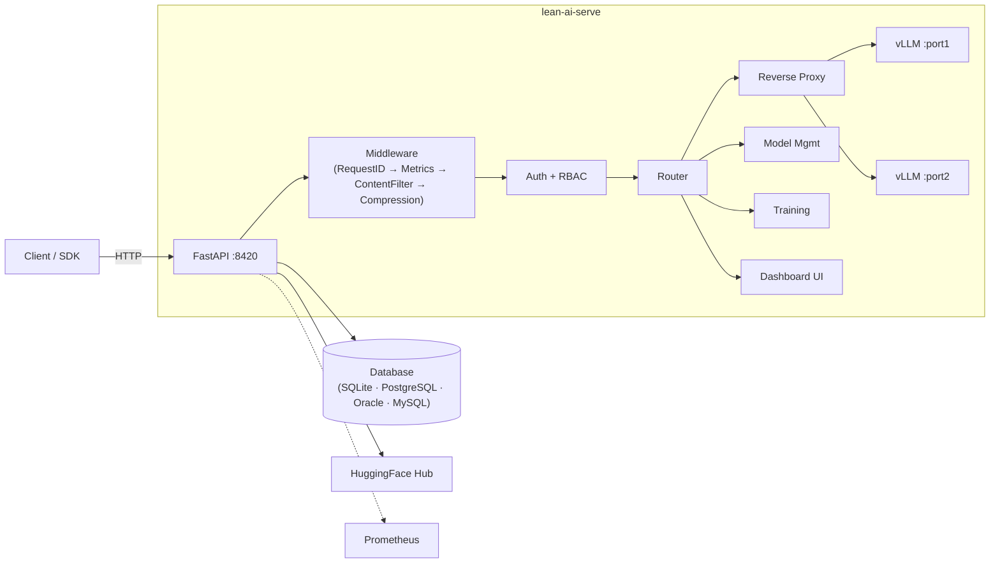

# lean-ai-serve

[](https://www.python.org/downloads/)
[](LICENSE)
[](https://fastapi.tiangolo.com)

**Secure vLLM inference server with model management, fine-tuning, and HIPAA-grade audit logging.**

lean-ai-serve wraps [vLLM](https://github.com/vllm-project/vllm) with enterprise features: an OpenAI-compatible API, multi-model GPU management, authentication (API keys, LDAP, OIDC), role-based access control, tamper-proof audit logging, encryption at rest, LoRA fine-tuning, and full observability. Deploy production LLM inference with a single YAML config file.

## Features

| Category | Capabilities |
|----------|-------------|
| **Inference** | OpenAI-compatible API (`/v1/chat/completions`, `/v1/completions`, `/v1/embeddings`), streaming, multi-model serving |
| **Model Management** | Pull from HuggingFace, load/unload, idle sleep/auto-wake, autoload, speculative decoding, KV cache tuning |
| **GPU Management** | Multi-GPU tensor & pipeline parallelism, per-model GPU assignment, memory utilization control |
| **Authentication** | API keys (bcrypt-hashed), LDAP/Active Directory, OIDC (Keycloak, Azure AD, etc.), combined modes |
| **Authorization** | RBAC with 6 roles (admin, model-manager, trainer, user, auditor, service-account), per-key model restrictions |
| **Audit & Compliance** | HIPAA-grade append-only audit log with SHA-256 hash chain, 6-year retention, chain verification |
| **Encryption** | AES-256 encryption at rest, master key from file/env/HashiCorp Vault, config secret patterns (`ENV[]`, `ENC[]`) |
| **Content Safety** | PHI/PII pattern detection with warn/redact/block actions |
| **Fine-Tuning** | LoRA training via LLaMA-Factory, dataset management, adapter deployment to running models |
| **Observability** | Prometheus metrics (zero-dependency), structured logging (JSON/console), OpenTelemetry tracing, alerting |
| **Web Dashboard** | Built-in server-rendered UI (HTMX + Jinja2 + Pico CSS) — model management, monitoring, security, training, settings. No Node.js required |
| **Context Compression** | LLMlingua2 prompt compression for long contexts |
| **Database** | Pluggable backend: SQLite (default), PostgreSQL, Oracle DB, MySQL — zero-config SQLite or bring your existing infrastructure |
| **CLI** | Full-featured CLI for all operations — start, pull, load, keys, audit, config, admin, training, db |

## Architecture



See [docs/architecture.md](docs/architecture.md) for detailed diagrams including request flow, model lifecycle state machine, authentication flow, training workflow, and startup sequence.

## Quick Start

### 1. Install

```bash
pip install lean-ai-serve

# With optional features:
pip install lean-ai-serve[gpu,ldap,vault,compression,training,tracing]

# With a specific database backend:
pip install lean-ai-serve[postgres]   # PostgreSQL via asyncpg
pip install lean-ai-serve[oracle]     # Oracle DB via oracledb
pip install lean-ai-serve[mysql]      # MySQL via aiomysql
```

### 2. Configure

```bash
# Copy the example config
cp config.example.yaml config.yaml

# Edit to your needs — at minimum, configure your models:
# models:
#   my-model:
#     source: "Qwen/Qwen3-Coder-30B-A3B"
#     gpu: [0, 1]
#     tensor_parallel_size: 2
#     autoload: true
```

### 3. Create an API Key

```bash
lean-ai-serve keys create --name "my-key" --role admin
# Save the output key — it is shown only once
```

### 4. Pull a Model

```bash
lean-ai-serve pull Qwen/Qwen3-Coder-30B-A3B --name my-model
```

### 5. Start the Server

```bash
lean-ai-serve start --config config.yaml
```

### 6. Make a Request

```bash
curl http://localhost:8420/v1/chat/completions \
  -H "Authorization: Bearer las-..." \
  -H "Content-Type: application/json" \
  -d '{
    "model": "my-model",
    "messages": [{"role": "user", "content": "Hello!"}],
    "max_tokens": 256
  }'
```

## CLI Overview

| Command | Description |
|---------|-------------|
| `lean-ai-serve start` | Start the inference server |
| `lean-ai-serve pull <source>` | Download a model from HuggingFace |
| `lean-ai-serve models` | List all registered models and their states |
| `lean-ai-serve load <name>` | Load a model into vLLM for serving |
| `lean-ai-serve unload <name>` | Unload a model (stop vLLM process) |
| `lean-ai-serve status` | Show GPU utilization and loaded models |
| `lean-ai-serve check` | Pre-flight validation (config, GPUs, dependencies) |
| `lean-ai-serve keys ...` | Create, list, and revoke API keys |
| `lean-ai-serve audit ...` | Query and verify audit logs |
| `lean-ai-serve config ...` | Show, validate, generate-key, encrypt/decrypt values |
| `lean-ai-serve admin ...` | Audit export, DB stats, token cleanup |
| `lean-ai-serve db ...` | Database setup and diagnostics (init, check, info) |
| `lean-ai-serve training ...` | Manage datasets, jobs, and adapters |

See [docs/cli-reference.md](docs/cli-reference.md) for full usage details.

## API Overview

| Endpoint | Description |
|----------|-------------|
| `GET /health` | Health check (no auth) |
| `GET /metrics` | Prometheus metrics (no auth) |
| `POST /v1/chat/completions` | Chat inference (OpenAI-compatible) |
| `POST /v1/completions` | Text/FIM completions |
| `POST /v1/embeddings` | Embeddings |
| `GET /v1/models` | List loaded models |
| `GET /api/models` | List all models with full metadata |
| `POST /api/models/pull` | Download model (SSE progress) |
| `POST /api/models/{name}/load` | Load model into vLLM |
| `POST /api/models/{name}/unload` | Unload model |
| `POST /api/models/{name}/sleep` | Put model to sleep |
| `POST /api/models/{name}/wake` | Wake sleeping model |
| `POST /api/auth/login` | LDAP login (returns JWT) |
| `POST /api/keys` | Create API key |
| `GET /api/audit/logs` | Query audit entries |
| `GET /api/usage/me` | Current user's token usage |
| `POST /api/training/jobs` | Submit fine-tuning job |
| `GET /dashboard/` | Web dashboard (session-authenticated) |

See [docs/api-reference.md](docs/api-reference.md) for the complete API reference with request/response examples.

## Optional Dependencies

lean-ai-serve uses extras to keep the base install lightweight:

| Extra | Package | Purpose |
|-------|---------|---------|
| `postgres` | asyncpg | PostgreSQL database backend |
| `oracle` | oracledb | Oracle DB database backend |
| `mysql` | aiomysql | MySQL database backend |
| `gpu` | nvidia-ml-py | GPU monitoring and metrics |
| `ldap` | ldap3 | LDAP/Active Directory authentication |
| `vault` | hvac | HashiCorp Vault encryption key management |
| `compression` | llmlingua | LLMlingua2 context compression |
| `training` | pandas | Dataset handling for fine-tuning |
| `tracing` | opentelemetry-* | Distributed tracing via OTLP |
| `dev` | pytest, ruff, etc. | Development and testing |

```bash
# Install all optional dependencies
pip install lean-ai-serve[gpu,ldap,vault,compression,training,tracing]

# Example: all features with PostgreSQL
pip install lean-ai-serve[gpu,ldap,vault,compression,training,tracing,postgres]
```

## Documentation

| Document | Description |
|----------|-------------|
| [Getting Started](docs/getting-started.md) | Installation, first model, first request |
| [Architecture](docs/architecture.md) | System diagrams, component map, data flow |
| [Configuration](docs/configuration.md) | Full YAML config reference with examples |
| [API Reference](docs/api-reference.md) | All HTTP endpoints with curl examples |
| [CLI Reference](docs/cli-reference.md) | All CLI commands with usage and examples |
| [Authentication](docs/authentication.md) | API keys, LDAP, OIDC, RBAC, rate limiting |
| [Model Management](docs/model-management.md) | Lifecycle, GPU assignment, sleep/wake, speculative decoding |
| [Security & Compliance](docs/security-and-compliance.md) | Audit logging, encryption, Vault, content filtering, HIPAA |
| [Training Guide](docs/training-guide.md) | Datasets, LoRA fine-tuning, adapter deployment |
| [Observability](docs/observability.md) | Metrics, logging, tracing, alerting |
| [Deployment](docs/deployment.md) | Production checklist, systemd, Docker, nginx |
| [Azure Deployment](docs/deploy-azure.md) | GPU VMs, AKS, Key Vault, Azure AD, Application Gateway |
| [AWS Deployment](docs/deploy-aws.md) | EC2/EKS with GPU, RDS, Secrets Manager, ALB, Cognito |
| [GCP Deployment](docs/deploy-gcp.md) | Compute Engine/GKE, Cloud SQL, Secret Manager, Cloud LB |
| [Contributing](docs/contributing.md) | Development setup, testing, code structure |

## License

MIT
