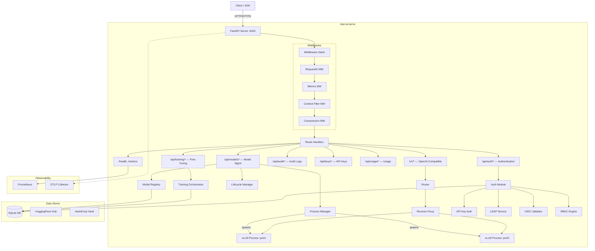
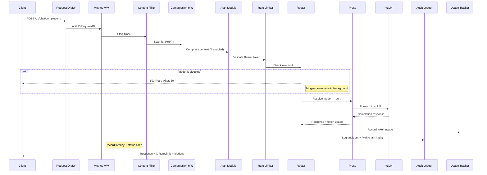
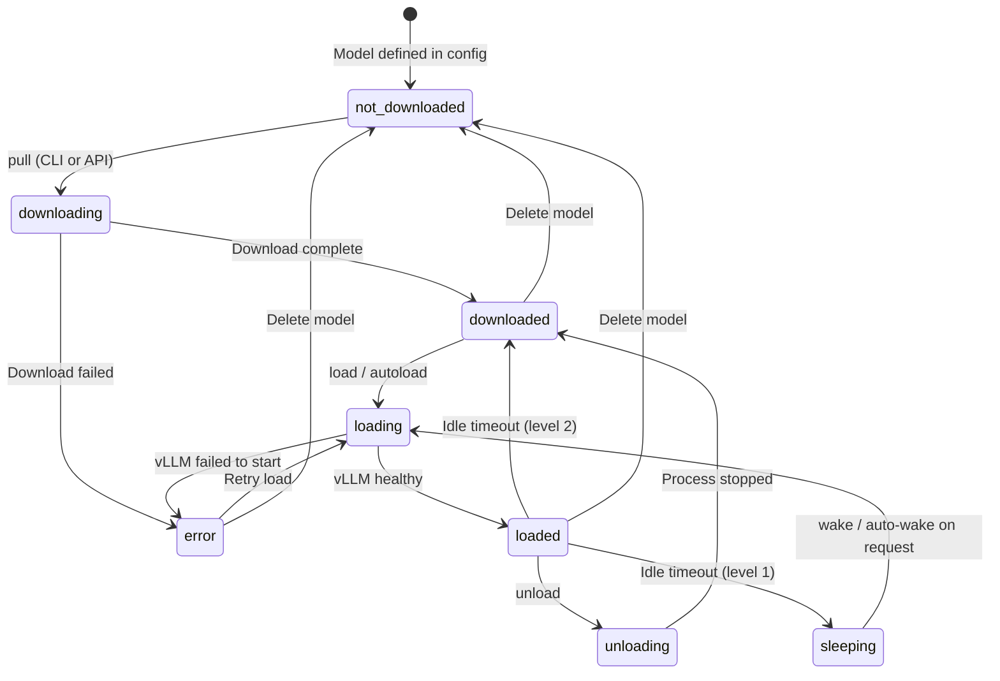
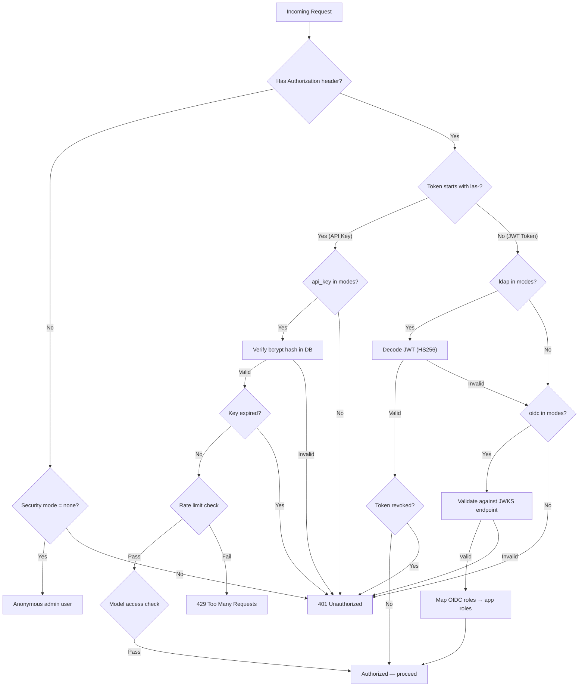
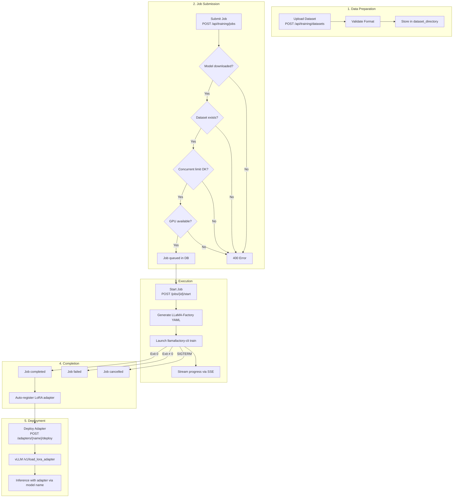
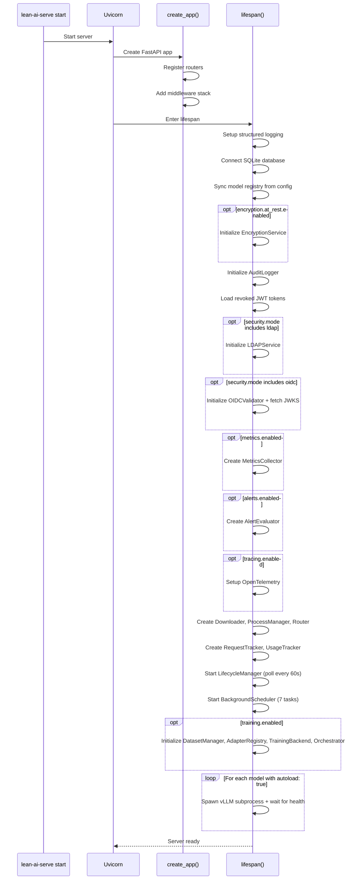

# Architecture

This document describes the internal architecture of lean-ai-serve, including system diagrams, component responsibilities, and data flow.

## System Architecture



## Request Flow

Sequence diagram showing an inference request from client to vLLM and back:



## Model Lifecycle State Machine

Models transition through the following states:



**State descriptions:**

| State | Description |
|-------|-------------|
| `not_downloaded` | Model is registered in config but files are not on disk |
| `downloading` | Model is being pulled from HuggingFace Hub |
| `downloaded` | Model files are cached locally, not loaded into GPU |
| `loading` | vLLM subprocess is starting and running health checks |
| `loaded` | Model is serving inference requests |
| `sleeping` | Process stopped, auto-wake enabled (level 1 only) |
| `unloading` | Process is being stopped |
| `error` | An operation failed (download, load, etc.) |

## Authentication Flow



## Training Workflow



## Startup Sequence



## Component Map

| Directory | Module | Responsibility |
|-----------|--------|----------------|
| `api/` | `openai_compat.py` | OpenAI-compatible inference endpoints (`/v1/*`) |
| | `models.py` | Model lifecycle API (pull, load, unload, sleep, wake, delete) |
| | `health.py` | Health check and status endpoints |
| | `keys.py` | API key CRUD |
| | `audit_routes.py` | Audit log query and chain verification |
| | `auth_routes.py` | Login, logout, refresh, user info |
| | `usage.py` | Usage tracking queries |
| | `metrics.py` | Prometheus metrics and alert endpoints |
| | `training.py` | Training jobs, datasets, adapters API |
| `cli/` | `main.py` | Typer CLI entry point and top-level commands |
| | `keys.py` | API key management subcommands |
| | `audit.py` | Audit query and verify subcommands |
| | `config_cmd.py` | Config show, validate, encrypt/decrypt subcommands |
| | `admin.py` | Admin tasks (audit-export, db-stats, token-cleanup) |
| | `training.py` | Training CLI subcommands |
| `engine/` | `process.py` | vLLM subprocess lifecycle (start, stop, health check) |
| | `proxy.py` | HTTP reverse proxy to vLLM (streaming + non-streaming) |
| | `router.py` | Model name → port resolution |
| | `lifecycle.py` | Idle sleep/wake daemon + request tracking |
| | `validators.py` | Configuration validation (GPU, speculative decoding) |
| `models/` | `registry.py` | Model state persistence (SQLite) |
| | `downloader.py` | HuggingFace Hub download with progress streaming |
| | `schemas.py` | Pydantic models for API request/response types |
| `security/` | `auth.py` | Authentication dispatch (API key, JWT, LDAP, OIDC) |
| | `ldap_auth.py` | LDAP/Active Directory integration |
| | `oidc.py` | OIDC token validation with JWKS caching |
| | `rbac.py` | Role-based access control (6 roles, permissions) |
| | `audit.py` | HIPAA-grade audit logging with SHA-256 hash chain |
| | `encryption.py` | AES-256 encryption at rest |
| | `vault.py` | HashiCorp Vault key provider |
| | `rate_limiter.py` | Per-API-key sliding window rate limiting |
| | `content_filter.py` | PHI/PII pattern detection (warn/redact/block) |
| | `secrets.py` | ENV[] and ENC[] secret resolution |
| | `usage.py` | Token usage tracking and aggregation |
| `observability/` | `metrics.py` | Dict-based Prometheus metrics (no external dependency) |
| | `middleware.py` | HTTP request metrics middleware |
| | `logging.py` | Structured logging (structlog) + RequestID middleware |
| | `alerts.py` | Rule-based alert evaluation |
| | `tasks.py` | Background scheduler (7 periodic tasks) |
| | `tracing.py` | OpenTelemetry integration |
| `middleware/` | `compression.py` | LLMlingua2 context compression |
| `training/` | `orchestrator.py` | Training job lifecycle and GPU scheduling |
| | `backend.py` | Training backend abstraction (LLaMA-Factory) |
| | `datasets.py` | Dataset upload, validation, and storage |
| | `adapters.py` | LoRA adapter registry and deployment |
| | `schemas.py` | Training data models |
| `utils/` | `gpu.py` | NVIDIA GPU introspection via nvidia-ml-py |
| Root | `main.py` | FastAPI app factory and lifespan management |
| | `config.py` | YAML configuration system (Pydantic) |
| | `db.py` | Async SQLite database layer |

## Source Tree

```
src/lean_ai_serve/
├── __init__.py                 # Package version
├── main.py                     # FastAPI app factory + lifespan
├── config.py                   # YAML config → Pydantic models
├── db.py                       # Async SQLite wrapper
├── api/                        # HTTP route handlers
│   ├── openai_compat.py        # /v1/chat/completions, /v1/completions, etc.
│   ├── models.py               # /api/models/* (CRUD + lifecycle)
│   ├── health.py               # /health, /api/status, /api/gpu
│   ├── keys.py                 # /api/keys/* (API key management)
│   ├── audit_routes.py         # /api/audit/* (query + verify)
│   ├── auth_routes.py          # /api/auth/* (login, logout, refresh)
│   ├── usage.py                # /api/usage/* (token tracking)
│   ├── metrics.py              # /metrics, /api/metrics/*
│   └── training.py             # /api/training/* (datasets, jobs, adapters)
├── cli/                        # Typer CLI commands
│   ├── main.py                 # Entry point + top-level commands
│   ├── keys.py                 # keys create/list/revoke
│   ├── audit.py                # audit query/verify
│   ├── config_cmd.py           # config show/validate/generate-key/encrypt-value
│   ├── admin.py                # admin audit-verify/audit-export/db-stats/token-cleanup
│   └── training.py             # training datasets/jobs/adapters
├── engine/                     # vLLM process management
│   ├── process.py              # Subprocess lifecycle
│   ├── proxy.py                # HTTP reverse proxy
│   ├── router.py               # Model → port resolver
│   ├── lifecycle.py            # Idle sleep/wake daemon
│   └── validators.py           # Pre-flight config validation
├── models/                     # Model management
│   ├── registry.py             # State persistence (SQLite)
│   ├── downloader.py           # HuggingFace download
│   └── schemas.py              # Pydantic schemas
├── security/                   # Authentication & compliance
│   ├── auth.py                 # Auth dispatcher
│   ├── ldap_auth.py            # LDAP/AD client
│   ├── oidc.py                 # OIDC/JWKS validator
│   ├── rbac.py                 # Role permissions
│   ├── audit.py                # Hash-chain audit logger
│   ├── encryption.py           # AES-256 encryption
│   ├── vault.py                # Vault key provider
│   ├── rate_limiter.py         # Sliding window rate limiter
│   ├── content_filter.py       # PHI/PII detection
│   ├── secrets.py              # ENV[]/ENC[] resolver
│   └── usage.py                # Usage tracker
├── observability/              # Monitoring & logging
│   ├── metrics.py              # Prometheus metrics collector
│   ├── middleware.py            # Request metrics middleware
│   ├── logging.py              # Structured logging setup
│   ├── alerts.py               # Alert rule evaluator
│   ├── tasks.py                # Background scheduler
│   └── tracing.py              # OpenTelemetry setup
├── middleware/                  # HTTP middleware
│   └── compression.py          # LLMlingua2 context compression
├── training/                   # Fine-tuning subsystem
│   ├── orchestrator.py         # Job lifecycle
│   ├── backend.py              # LLaMA-Factory backend
│   ├── datasets.py             # Dataset manager
│   ├── adapters.py             # LoRA adapter registry
│   └── schemas.py              # Training schemas
└── utils/                      # Utilities
    └── gpu.py                  # NVIDIA GPU info
```

## Database Schema

lean-ai-serve uses SQLite for all persistent state. Tables:

| Table | Purpose | Key Columns |
|-------|---------|-------------|
| `models` | Model registry | name, source, state, port, pid, gpu_assignment, config_json |
| `api_keys` | API key store | id, name, key_hash, key_prefix, role, models, rate_limit, expires_at |
| `audit_log` | Tamper-proof audit trail | id, timestamp, user_id, action, model, prompt_hash, chain_hash |
| `usage` | Hourly token usage | hour, user_id, model, prompt_tokens, completion_tokens |
| `revoked_tokens` | JWT revocation list | jti, revoked_at, expires_at |
| `training_jobs` | Fine-tuning jobs | job_id, model, state, dataset, adapter_id |
| `adapters` | LoRA adapter metadata | name, base_model, source_path, state |
| `datasets` | Training datasets | name, format, size_bytes, row_count, uploaded_by |

## Shutdown Sequence

Shutdown proceeds in reverse order with 15-second per-component timeout guards:

1. **Background scheduler** — cancel all periodic tasks
2. **Auth connectors** — close LDAP pool, OIDC, adapter registry (in parallel)
3. **Lifecycle manager** — stop idle/wake polling
4. **Process manager** — SIGTERM all vLLM subprocesses (30s grace → SIGKILL)
5. **Proxy client** — close httpx connection pool
6. **Database** — final writes, close connection
