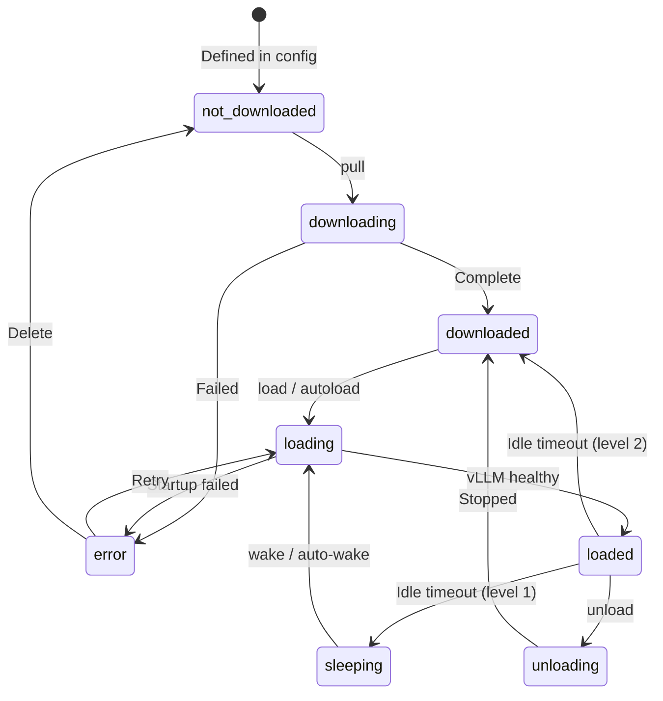

# Model Management

This guide covers the full model lifecycle: downloading, loading, serving, sleep/wake management, multi-GPU configuration, and advanced vLLM features.

## Model Lifecycle

Models progress through a state machine from download to serving:



See [architecture.md](architecture.md) for state descriptions.

## Pulling Models from HuggingFace

### CLI

```bash
# Pull with auto-generated name (uses last segment of repo ID)
lean-ai-serve pull Qwen/Qwen2.5-7B-Instruct

# Pull with custom name
lean-ai-serve pull Qwen/Qwen2.5-7B-Instruct --name qwen-7b
```

### API

```bash
curl -X POST http://localhost:8420/api/models/pull \
  -H "Authorization: Bearer las-..." \
  -H "Content-Type: application/json" \
  -d '{"source": "Qwen/Qwen2.5-7B-Instruct", "name": "qwen-7b"}'
```

The API returns a Server-Sent Events (SSE) stream with download progress:

```
data: {"status": "downloading", "filename": "model-00001-of-00004.safetensors", "progress_pct": 45.2}
data: {"status": "downloading", "filename": "model-00002-of-00004.safetensors", "progress_pct": 0.0}
...
data: {"status": "complete", "message": "Model downloaded successfully"}
```

### HuggingFace token

For gated models (LLaMA, Gemma, etc.), configure your HuggingFace token:

```yaml
cache:
  huggingface_token: "ENV[HF_TOKEN]"
```

```bash
export HF_TOKEN="hf_..."
```

Models are cached in `~/.cache/lean-ai-serve/models/` (configurable via `cache.directory`).

## Loading Models

Loading starts a vLLM subprocess for the model.

### CLI

```bash
lean-ai-serve load qwen-7b
```

### API

```bash
curl -X POST http://localhost:8420/api/models/qwen-7b/load \
  -H "Authorization: Bearer las-..."
```

The load process:
1. Finds a free port
2. Spawns `python -m vllm.entrypoints.openai.api_server` as a subprocess
3. Sets `CUDA_VISIBLE_DEVICES` to restrict GPU access
4. Health-checks every 3 seconds until vLLM responds (600s timeout)
5. Records port and PID in the registry

### Autoload

Models with `autoload: true` are loaded automatically when the server starts:

```yaml
models:
  qwen-7b:
    source: "Qwen/Qwen2.5-7B-Instruct"
    gpu: [0]
    autoload: true
```

## Model Configuration

Each model supports extensive configuration in `config.yaml`:

```yaml
models:
  qwen-30b:
    source: "Qwen/Qwen3-Coder-30B-A3B"
    gpu: [0, 1]
    tensor_parallel_size: 2
    max_model_len: 131072
    dtype: "auto"
    gpu_memory_utilization: 0.90
    task: "chat"
    tool_call_parser: "hermes"
    reasoning_parser: "qwen3"
    guided_decoding_backend: "xgrammar"
    autoload: true

    # LoRA adapters
    enable_lora: true
    max_loras: 4
    max_lora_rank: 64

    # KV cache tuning
    kv_cache:
      dtype: "fp8_e4m3"
      calculate_scales: true

    # Context settings
    context:
      enable_prefix_caching: true
      cpu_offload_gb: 0
      swap_space: 4

    # Speculative decoding
    speculative:
      enabled: true
      strategy: "draft"
      draft_model: "Qwen/Qwen2.5-0.5B"
      num_tokens: 5

    # Lifecycle
    lifecycle:
      idle_sleep_timeout: 3600
      sleep_level: 1
      auto_wake_on_request: true
```

### Key configuration fields

| Field | Default | Description |
|-------|---------|-------------|
| `source` | (required) | HuggingFace repo ID or local path |
| `gpu` | `[0]` | List of GPU indices to use |
| `tensor_parallel_size` | `1` | Number of GPUs for tensor parallelism |
| `pipeline_parallel_size` | `1` | Number of GPUs for pipeline parallelism |
| `max_model_len` | `null` | Maximum context length (null = model default) |
| `dtype` | `auto` | Model data type (auto, float16, bfloat16) |
| `quantization` | `null` | Quantization method |
| `task` | `chat` | Model task: chat, embed, or generate |
| `gpu_memory_utilization` | `0.90` | Fraction of GPU memory to use (from defaults) |
| `autoload` | `false` | Automatically load on server start |
| `enable_lora` | `false` | Enable LoRA adapter support |
| `tool_call_parser` | `null` | Tool call parser (hermes, etc.) |
| `reasoning_parser` | `null` | Reasoning parser (qwen3, etc.) |

## Multi-GPU Configuration

### Tensor parallelism

Split model layers across GPUs for large models:

```yaml
models:
  large-model:
    source: "meta-llama/Llama-3-70B-Instruct"
    gpu: [0, 1, 2, 3]
    tensor_parallel_size: 4
```

### Pipeline parallelism

Split model stages across GPUs (useful for very large models):

```yaml
models:
  huge-model:
    source: "meta-llama/Llama-3-405B-Instruct"
    gpu: [0, 1, 2, 3, 4, 5, 6, 7]
    tensor_parallel_size: 4
    pipeline_parallel_size: 2
```

### Multiple models on different GPUs

```yaml
models:
  chat-model:
    source: "Qwen/Qwen2.5-7B-Instruct"
    gpu: [0]

  embed-model:
    source: "BAAI/bge-large-en-v1.5"
    gpu: [1]
    task: "embed"
```

## Idle Sleep / Wake

The lifecycle manager monitors model activity and can automatically sleep idle models to free GPU memory.

### Configuration

```yaml
models:
  my-model:
    lifecycle:
      idle_sleep_timeout: 3600  # Sleep after 1 hour idle (0 = never)
      sleep_level: 1            # 1 = auto-wake, 2 = full unload
      auto_wake_on_request: true
```

### Sleep levels

| Level | Behavior | Wake |
|-------|----------|------|
| **1** | Stop vLLM process, state = `sleeping` | Auto-wake on inference request or manual wake |
| **2** | Stop vLLM process, state = `downloaded` | Manual load required |

### Auto-wake behavior

When a sleeping model (level 1) receives an inference request:

1. Server returns `503 Service Unavailable` with `Retry-After: 30` header
2. Background task begins waking the model (spawns vLLM)
3. Client retries after the suggested delay
4. Subsequent requests succeed once the model is healthy

### Manual sleep/wake

```bash
# Sleep
curl -X POST http://localhost:8420/api/models/my-model/sleep \
  -H "Authorization: Bearer las-..."

# Wake
curl -X POST http://localhost:8420/api/models/my-model/wake \
  -H "Authorization: Bearer las-..."
```

## Speculative Decoding

Speculative decoding uses a smaller draft model to predict tokens, which the main model verifies in parallel, improving throughput.

### Strategies

| Strategy | Description | Config |
|----------|-------------|--------|
| `draft` | Use a smaller draft model | Requires `draft_model` |
| `ngram` | N-gram based prediction | No extra model needed |
| `eagle` | EAGLE speculative decoding | Requires EAGLE model |

### Example: draft model

```yaml
models:
  my-model:
    source: "Qwen/Qwen2.5-32B-Instruct"
    gpu: [0, 1]
    tensor_parallel_size: 2
    speculative:
      enabled: true
      strategy: "draft"
      draft_model: "Qwen/Qwen2.5-0.5B"
      num_tokens: 5
      draft_tensor_parallel_size: 1
```

### Example: ngram

```yaml
models:
  my-model:
    speculative:
      enabled: true
      strategy: "ngram"
      num_tokens: 5
```

## KV Cache Options

### FP8 KV cache

Reduces memory usage by storing key-value cache in FP8 format:

```yaml
models:
  my-model:
    kv_cache:
      dtype: "fp8_e4m3"
      calculate_scales: true
```

### Prefix caching

Enables automatic prefix caching for repeated prompt prefixes:

```yaml
models:
  my-model:
    context:
      enable_prefix_caching: true
```

### CPU offload

Offload KV cache to CPU memory for longer contexts:

```yaml
models:
  my-model:
    context:
      cpu_offload_gb: 4    # Offload 4 GB to CPU
      swap_space: 8         # 8 GiB swap for KV cache
```

## Unloading and Deleting

### Unload (stop serving, keep files)

```bash
lean-ai-serve unload my-model

# or via API
curl -X POST http://localhost:8420/api/models/my-model/unload \
  -H "Authorization: Bearer las-..."
```

### Delete (remove from registry and delete cached files)

```bash
curl -X DELETE http://localhost:8420/api/models/my-model \
  -H "Authorization: Bearer las-..."
```
