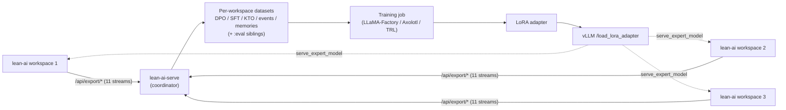

# Training Guide

lean-ai-serve includes a fine-tuning subsystem for LoRA training via [LLaMA-Factory](https://github.com/hiyouga/LLaMA-Factory), with dataset management, job orchestration, and dynamic adapter deployment.

## Prerequisites

1. **Enable training** in `config.yaml`:

```yaml
training:
  enabled: true
  backend: "llama-factory"
  max_concurrent_jobs: 1
  default_gpu: [0]
  max_dataset_size_mb: 1024
```

2. **Install LLaMA-Factory** (separate from lean-ai-serve):

```bash
pip install llamafactory
# or follow https://github.com/hiyouga/LLaMA-Factory#installation
```

The `llamafactory-cli` command must be available in PATH.

3. **Install dataset utilities**:

```bash
pip install lean-ai-serve[training]
```

## Workflow Overview


## Dataset Management

### Supported formats

| Format | Description |
|--------|-------------|
| `sharegpt` | ShareGPT conversation format (JSON array of conversations) |
| `alpaca` | Alpaca instruction format (instruction, input, output) |
| `jsonl` | JSON Lines (one JSON object per line) |
| `csv` | CSV with header row |

### Upload a dataset

```bash
curl -X POST http://localhost:8420/api/training/datasets \
  -H "Authorization: Bearer las-..." \
  -F "file=@training_data.jsonl" \
  -F "name=medical-qa" \
  -F "format=sharegpt" \
  -F "description=Medical Q&A dataset for fine-tuning"
```

Response:

```json
{
  "name": "medical-qa",
  "format": "sharegpt",
  "size_bytes": 2048576,
  "row_count": 5000,
  "uploaded_by": "admin",
  "description": "Medical Q&A dataset for fine-tuning",
  "created_at": "2026-04-01T12:00:00Z"
}
```

### List datasets

```bash
curl http://localhost:8420/api/training/datasets \
  -H "Authorization: Bearer las-..."
```

### Preview dataset

```bash
curl "http://localhost:8420/api/training/datasets/medical-qa/preview?limit=3" \
  -H "Authorization: Bearer las-..."
```

### Delete dataset

```bash
curl -X DELETE http://localhost:8420/api/training/datasets/medical-qa \
  -H "Authorization: Bearer las-..."
```

## Submitting a Training Job

### Submit

```bash
curl -X POST http://localhost:8420/api/training/jobs \
  -H "Authorization: Bearer las-..." \
  -H "Content-Type: application/json" \
  -d '{
    "name": "medical-finetune-v1",
    "base_model": "qwen-7b",
    "dataset": "medical-qa",
    "num_epochs": 3,
    "learning_rate": 2e-4,
    "per_device_batch_size": 4,
    "lora_rank": 16,
    "lora_alpha": 32,
    "gpu": [1]
  }'
```

Response:

```json
{
  "job_id": "job-abc123",
  "name": "medical-finetune-v1",
  "base_model": "qwen-7b",
  "dataset": "medical-qa",
  "state": "queued",
  "submitted_by": "admin",
  "created_at": "2026-04-01T12:30:00Z"
}
```

### Job lifecycle

| State | Description |
|-------|-------------|
| `queued` | Job submitted, waiting to start |
| `running` | Training in progress |
| `completed` | Training finished, adapter registered |
| `failed` | Training failed (check error_message) |
| `cancelled` | Cancelled by user |

### Start and stream progress

```bash
curl http://localhost:8420/api/training/jobs/job-abc123/start \
  -H "Authorization: Bearer las-..."
```

Returns an SSE stream:

```
data: {"event": "step", "step": 100, "total_steps": 1500, "loss": 1.42, "learning_rate": 0.0002}
data: {"event": "step", "step": 200, "total_steps": 1500, "loss": 1.15, "learning_rate": 0.00019}
data: {"event": "eval", "step": 500, "eval_loss": 1.08}
...
data: {"event": "complete", "adapter_name": "medical-finetune-v1", "output_path": "/..."}
```

### Cancel a job

```bash
curl -X POST http://localhost:8420/api/training/jobs/job-abc123/cancel \
  -H "Authorization: Bearer las-..."
```

### List jobs

```bash
# All jobs
curl http://localhost:8420/api/training/jobs \
  -H "Authorization: Bearer las-..."

# Filter by state
curl "http://localhost:8420/api/training/jobs?state=completed" \
  -H "Authorization: Bearer las-..."
```

## GPU Scheduling

Training jobs require GPU resources. The orchestrator checks:

1. **Concurrent job limit** — `max_concurrent_jobs` (default: 1)
2. **GPU availability** — requested GPUs must not overlap with running training jobs
3. **Default GPU** — if no GPU specified, uses `training.default_gpu`

Check current GPU usage by training:

```bash
curl http://localhost:8420/api/training/gpu-status \
  -H "Authorization: Bearer las-..."
```

## LoRA Adapters

### Auto-registration

When a training job completes successfully, its LoRA adapter is automatically registered in the adapter registry.

### Import external adapters

Import adapters trained outside lean-ai-serve:

```bash
curl -X POST http://localhost:8420/api/training/adapters/import \
  -H "Authorization: Bearer las-..." \
  -H "Content-Type: application/json" \
  -d '{
    "name": "external-adapter",
    "base_model": "qwen-7b",
    "path": "/path/to/adapter/weights"
  }'
```

### List adapters

```bash
# All adapters
curl http://localhost:8420/api/training/adapters \
  -H "Authorization: Bearer las-..."

# Filter by base model
curl "http://localhost:8420/api/training/adapters?base_model=qwen-7b" \
  -H "Authorization: Bearer las-..."
```

### Deploy adapter to running model

The base model must have `enable_lora: true` in its config and be in the `loaded` state:

```yaml
models:
  qwen-7b:
    source: "Qwen/Qwen2.5-7B-Instruct"
    enable_lora: true
    max_loras: 4
```

Deploy:

```bash
curl -X POST http://localhost:8420/api/training/adapters/medical-finetune-v1/deploy \
  -H "Authorization: Bearer las-..." \
  -H "Content-Type: application/json" \
  -d '{"model_name": "qwen-7b"}'
```

This calls vLLM's `/v1/load_lora_adapter` endpoint to dynamically load the adapter.

### Undeploy adapter

```bash
curl -X POST http://localhost:8420/api/training/adapters/medical-finetune-v1/undeploy \
  -H "Authorization: Bearer las-..."
```

### Delete adapter

```bash
curl -X DELETE http://localhost:8420/api/training/adapters/medical-finetune-v1 \
  -H "Authorization: Bearer las-..."
```

## End-to-End Example

Complete workflow from dataset to inference with a fine-tuned adapter:

```bash
# 1. Upload training data
curl -X POST http://localhost:8420/api/training/datasets \
  -H "Authorization: Bearer las-..." \
  -F "file=@medical_qa.jsonl" \
  -F "name=medical-qa" \
  -F "format=sharegpt"

# 2. Submit training job
curl -X POST http://localhost:8420/api/training/jobs \
  -H "Authorization: Bearer las-..." \
  -H "Content-Type: application/json" \
  -d '{
    "name": "medical-v1",
    "base_model": "qwen-7b",
    "dataset": "medical-qa",
    "num_epochs": 3,
    "learning_rate": 2e-4,
    "lora_rank": 16
  }'
# Returns: {"job_id": "job-abc123", ...}

# 3. Start and monitor training
curl http://localhost:8420/api/training/jobs/job-abc123/start \
  -H "Authorization: Bearer las-..."
# SSE stream with progress events...

# 4. Deploy adapter (auto-registered on completion)
curl -X POST http://localhost:8420/api/training/adapters/medical-v1/deploy \
  -H "Authorization: Bearer las-..." \
  -H "Content-Type: application/json" \
  -d '{"model_name": "qwen-7b"}'

# 5. Inference using the adapter
curl http://localhost:8420/v1/chat/completions \
  -H "Authorization: Bearer las-..." \
  -H "Content-Type: application/json" \
  -d '{
    "model": "qwen-7b",
    "messages": [{"role": "user", "content": "What are the symptoms of diabetes?"}],
    "max_tokens": 256
  }'
```

## lean-ai Workspace Ingestion

lean-ai-serve can act as a **self-improvement coordinator** for [lean-ai](https://github.com/shunobies/lean-ai), the companion agentic coding assistant. When ingestion is enabled, the server polls registered lean-ai workspaces on a schedule, pulls any new DPO (Direct Preference Optimization) pairs they have produced, and lands them as ready-to-train datasets. Those datasets feed directly into the standard [training job flow](#submitting-a-training-job) above — so the adapter you train and deploy is driven by real user feedback from everyday coding sessions.

### Why use them together

Each lean-ai session captures two high-signal kinds of preference data locally — no data leaves the developer's machine unless they explicitly opt in:

| Pair kind | Produced when… | DPO interpretation |
|-----------|-----------------|--------------------|
| `plan_rejection` | A user rejects or revises a proposed plan, then approves a later revision | `rejected` = the original plan, `chosen` = the revised plan |
| `validation_fix` | A fix attempt's tests/lints still fail, then a later attempt succeeds | `rejected` = the broken fix, `chosen` = the fix that passed |

Training a LoRA adapter on this data makes the planner propose better plans on the first try and the fixer converge faster. Because lean-ai already [anonymizes its exports](https://github.com/shunobies/lean-ai/blob/main/docs/training.md) (hashed session ids, `/workspace-<id>` path rewriting, salted `workspace_id`), one lean-ai-serve coordinator can safely pool data across many workspaces and train a single shared adapter — then every connected lean-ai workspace can point its `serve_expert_model` at that adapter and benefit from the pooled learning.



### Concepts

Each registered workspace produces **eleven** datasets on lean-ai-serve, one per lean-ai export stream:

| Dataset name | Format | Source endpoint |
|---|---|---|
| `lean_ai:<workspace_id>:dpo:plan_rejection` | DPO | `/traces?format=dpo` |
| `lean_ai:<workspace_id>:dpo:validation_fix` | DPO | `/traces?format=dpo` |
| `lean_ai:<workspace_id>:sft:traces` | JSONL | `/traces?format=sft` |
| `lean_ai:<workspace_id>:kto:traces` | JSONL | `/traces?format=kto` |
| `lean_ai:<workspace_id>:dpo:tool_calls` | DPO | `/tool-executions?format=dpo_pairs` |
| `lean_ai:<workspace_id>:sft:tool_compressions` | JSONL | `/tool-compressions` |
| `lean_ai:<workspace_id>:sft:phase2` | JSONL | `/phase2-syntheses` |
| `lean_ai:<workspace_id>:sft:clarifications` | JSONL | `/clarifications` |
| `lean_ai:<workspace_id>:kto:diff_decisions` | JSONL | `/diff-decisions` |
| `lean_ai:<workspace_id>:events` | JSONL | `/events` |
| `lean_ai:<workspace_id>:memories` | JSONL | `/memories` (snapshot/replace) |

Discovery-driven: any new `pair_kind` lean-ai emits automatically gets its own `lean_ai:<workspace_id>:dpo:<kind>` dataset on first sighting. Append-only streams dedupe per-row using a stream-specific identity (pair_id, trace_uuid, diff_hash, etc.) so re-polls are idempotent. The memories dataset is atomically replaced when its payload hash changes and untouched otherwise.

If `ingestion.holdout_fraction > 0` a sibling `<name>:eval` dataset is created alongside each main dataset and receives a deterministic fraction of the rows (hashed on `(salt, workspace_id, dataset, row_key)`), so each workspace has a pristine hold-out evaluation set that the trainer never sees.

### Prerequisites

1. **Enable ingestion** in `config.yaml` (`training.enabled` must already be true):

```yaml
training:
  enabled: true

ingestion:
  enabled: true
  poll_interval_seconds: 600        # 10 minutes
  max_concurrent_pulls: 4
  page_limit: 500
  http_timeout_seconds: 30
```

2. **On each lean-ai workspace**, enable the export API (disabled by default — nothing leaves the machine without this):

```bash
export LEAN_AI_EXPORT_API_KEY="las-export-$(openssl rand -hex 24)"

# Optional — gives stable, deterministic workspace_ids across restarts:
export LEAN_AI_EXPORT_WORKSPACE_SALT="shared-secret"
```

### Register a workspace

The quickest path is the dashboard's Workspaces tab at `/dashboard/training` — one form, auto-detection of `workspace_id` from the remote, immediate validation. For scripted workflows:

```bash
curl -X POST http://localhost:8420/api/training/workspaces \
  -H "Authorization: Bearer las-..." \
  -H "Content-Type: application/json" \
  -d '{
    "display_name": "alice-workstation",
    "backend_url": "http://workstation.local:8422",
    "repo_root": "/home/alice/Code/lean_ai",
    "export_key": "las-export-..."
  }'
```

`repo_root` is the absolute path on the workspace host that lean-ai uses to identify its database — lean-ai's export endpoints require it on every request. At registration the coordinator calls `GET /api/export/workspace-id?repo_root=<path>` and adopts the returned id. If you already know the id and want to fail fast on a salt mismatch, include it in the body as `"workspace_id": "a1b2c3d4e5f6"` — the registration then rejects with 400 if the remote computes something different. On success, all per-workspace datasets are created empty and ready to receive rows on the next poll.

Export keys are encrypted at rest via AES-256-GCM when `encryption.at_rest` is enabled (same master key used for the audit log).

### Polling

Once registered, the background scheduler pulls new rows from every enabled workspace every `poll_interval_seconds` (default 600). Each cycle:

1. Fetch `/api/export/manifest` once to learn current per-stream row counts.
2. Compare against the persisted snapshot — skip any stream whose count is unchanged.
3. For each stream that moved, paginate with its stream-specific cursor (`id` for trace-backed streams, `since=<iso8601>` for aux streams, payload-hash for the memories snapshot).
4. Fan rows into per-stream datasets, deduping by the stream's natural key (`pair_id`, `trace_uuid`, `diff_hash`, row content hash, etc.). When `holdout_fraction > 0`, each row is deterministically routed to either the main dataset or its `:eval` sibling.
5. Write a row to `lean_ai_poll_history` summarising the cycle.

Manual kick-off for a single workspace (e.g. right after registration):

```bash
curl -X POST http://localhost:8420/api/training/workspaces/a1b2c3d4e5f6/poll \
  -H "Authorization: Bearer las-..."
```

### Forwarding diff decisions

Extensions that only know the coordinator URL can record a user accept/reject via the coordinator, which forwards it to the correct lean-ai workspace:

```bash
curl -X POST http://localhost:8420/api/training/workspaces/a1b2c3d4e5f6/diff-decision \
  -H "Authorization: Bearer las-..." \
  -H "Content-Type: application/json" \
  -d '{
    "session_id": "s1",
    "file_path": "src/foo.py",
    "accepted": false,
    "diff_hash": "abc123...",
    "note": "introduces regression",
    "trace_uuid": "uuid-..."
  }'
```

The coordinator injects the registered `repo_root` into the forwarded body. The row appears in the workspace's `diff_decisions` table and flows back into the next pull via the `:kto:diff_decisions` dataset.

### Purging workspace data

To wipe all ingested data for a workspace without un-registering it — for data rotation, or to honor a right-to-revoke request — issue a data-only delete:

```bash
curl -X DELETE http://localhost:8420/api/training/workspaces/a1b2c3d4e5f6/data \
  -H "Authorization: Bearer las-..."
# -> {"workspace_id": "a1b2c3d4e5f6", "datasets_cleared": [...], "rows_purged": 1423}
```

This truncates every dataset (main + `:eval` siblings), zeroes every stream cursor, and clears the manifest snapshot so the next scheduled poll re-pulls from the beginning. The workspace row, encrypted export key, display name, and `repo_root` survive — next poll just resumes with a clean slate. The operation acquires the background poller's lock so it can't interleave with an in-flight pull.

### Training on ingested data

Ingested datasets appear in `GET /api/training/datasets` alongside any manually uploaded data. Submit a training job the same way you would for any other dataset:

```bash
curl -X POST http://localhost:8420/api/training/jobs \
  -H "Authorization: Bearer las-..." \
  -H "Content-Type: application/json" \
  -d '{
    "name": "lean-ai-planner-v1",
    "base_model": "qwen-coder-30b",
    "dataset": "lean_ai:a1b2c3d4e5f6:dpo:plan_rejection",
    "num_epochs": 1,
    "learning_rate": 1e-5,
    "lora_rank": 16,
    "lora_alpha": 32
  }'
```

For DPO training, LLaMA-Factory expects a dataset_info entry with `"ranking": true` and columns mapped to `prompt`/`chosen`/`rejected`. The `dpo` format written by the ingestor uses exactly those top-level keys.

### Closing the loop — point lean-ai back at the trained adapter

After the training job completes and the adapter is deployed to a running vLLM model:

```bash
curl -X POST http://localhost:8420/api/training/adapters/lean-ai-planner-v1/deploy \
  -H "Authorization: Bearer las-..." \
  -H "Content-Type: application/json" \
  -d '{"model_name": "qwen-coder-30b"}'
```

Then in each lean-ai workspace's `config.yaml`:

```yaml
expert_llm_provider: serve
serve_url: "http://lean-ai-serve.internal:8420"
serve_api_key: "las-your-api-key"
serve_model: "qwen-coder-30b"
serve_expert_model: "lean-ai-planner-v1"   # the LoRA we just trained
```

Now the expert phases (planning, validation) route through the fine-tuned adapter. As new DPO pairs accumulate, periodic re-training produces successor adapters (`v2`, `v3`, …) and each workspace just updates `serve_expert_model` to adopt them — no code changes, no agent restart.

### Managing registered workspaces

The Workspaces tab under `/dashboard/training` is the everyday management surface — list view with per-row Poll / Disable / Purge / Delete buttons, a filter box, auto-refresh every 30 s, a collapsible Ingestion settings panel, and a per-workspace drill-down with the full stream breakdown and last 50 poll outcomes. The CLI / curl equivalents below are for scripted workflows.

```bash
# List workspaces with cursors + row counts
curl -H "Authorization: Bearer las-..." \
  http://localhost:8420/api/training/workspaces

# Force an immediate pull (normally runs on poll_interval_seconds)
curl -X POST http://localhost:8420/api/training/workspaces/a1b2c3d4e5f6/poll \
  -H "Authorization: Bearer las-..."

# Soft-disable (keeps datasets + cursors)
curl -X DELETE http://localhost:8420/api/training/workspaces/a1b2c3d4e5f6 \
  -H "Authorization: Bearer las-..."

# Re-enable a soft-disabled workspace
curl -X POST http://localhost:8420/api/training/workspaces/a1b2c3d4e5f6/enable \
  -H "Authorization: Bearer las-..."

# Purge data but keep the workspace — empties datasets, resets cursors,
# leaves the encrypted export key in place so polling resumes cleanly.
curl -X DELETE http://localhost:8420/api/training/workspaces/a1b2c3d4e5f6/data \
  -H "Authorization: Bearer las-..."

# Hard-delete (removes registration, datasets, cursors, poll history)
curl -X DELETE "http://localhost:8420/api/training/workspaces/a1b2c3d4e5f6?hard=true" \
  -H "Authorization: Bearer las-..."
```

### Security properties

- **Fail-closed on both ends.** lean-ai's export API is disabled unless `LEAN_AI_EXPORT_API_KEY` is set; lean-ai-serve's ingestion endpoints return `503` unless `ingestion.enabled: true`.
- **Registration verifies the remote's workspace_id.** The coordinator calls `GET /api/export/workspace-id?repo_root=...` before persisting. A salt mismatch or wrong `repo_root` fails fast with 400 instead of silently polling the wrong workspace.
- **Already anonymized.** Rows emitted by lean-ai have session ids hashed and repo paths rewritten. lean-ai-serve does not need to re-scrub.
- **Scoped permission.** All workspace endpoints require `workspace:manage` (granted to `admin` and `trainer`). Regular `user` API keys cannot register or poll workspaces.
- **Encrypted export keys.** When `encryption.at_rest` is enabled, stored export keys are AES-256-GCM encrypted with the same master key the audit log uses.
- **Cursor-atomic append.** The ingestor writes a page of rows and advances cursors in one transaction, so a crash mid-poll just replays the last page on next cycle — it never drops or double-counts data.
- **Stream-specific dedup.** Each stream has its own dedup key (DPO: `pair_id`; SFT traces: row-content hash; tool pairs: session+args hash; diff decisions: `diff_hash`; clarifications/phase2: `trace_uuid`; memories: content-hash snapshot). Re-polling a page or re-registering a workspace is always idempotent.
- **Purge-safe poll lock.** `DELETE /workspaces/{id}/data` acquires the background poller's lock before truncating datasets, so an in-flight pull can't land rows into freshly-cleared files.
- **Secrets never echoed.** Neither the encrypted export key nor `holdout_salt` appear in any API response or dashboard render — the dashboard config panel shows salt presence as a pill, not the value.

## CLI Commands

```bash
# List datasets
lean-ai-serve training datasets

# List jobs (optionally filter by state)
lean-ai-serve training jobs --state completed

# List adapters (optionally filter by model)
lean-ai-serve training adapters --model qwen-7b
```
